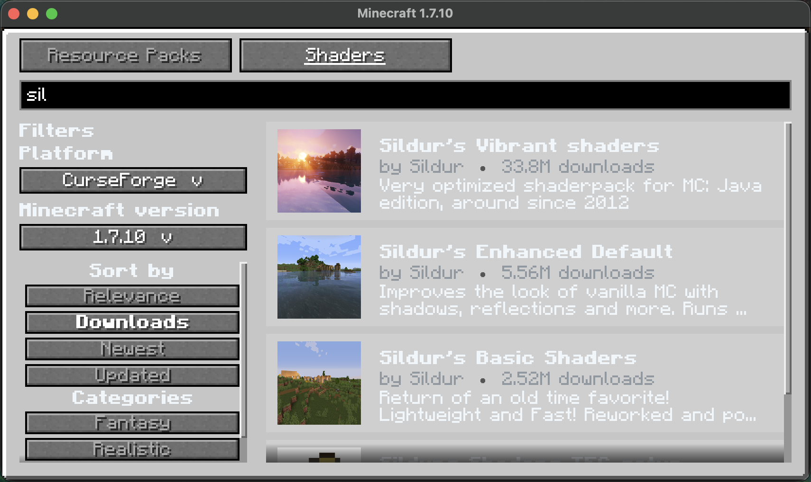

# Vintage Resourcify

`1.7.10` [DeDiamondPro/Resourcify](https://github.com/DeDiamondPro/Resourcify) backport.


[](https://github.com/JackOfNoneTrades/VintageResourcify/releases)
[](https://67.fentanylsolutions.org/mod/vintage-resourcify)
[](https://maven.fentanylsolutions.org/#/releases/org/fentanylsolutions/vintageresourcify/VintageResourcify)

[](https://discord.gg/xAWCqGrguG)

<!--
[](https://www.curseforge.com/minecraft/mc-mods/x)
[](https://modrinth.com/mod/x)
[]()-->

## Features

* Browse, download, remove, update resource packs and shaders ingame
* Added resource packs and shader file picker
* Drag and drop resource packs and shaders onto their respective screens ([lwjgl3ify](github.com/GTNewHorizons/lwjgl3ify) required)
* Support for adding third party Modrinth instances

Only the Angelica GUI is supported as of now (but you can still download shaders from the resource packs gui).



## Dependencies
* [UniMixins](https://modrinth.com/mod/unimixins) [](https://www.curseforge.com/minecraft/mc-mods/unimixins)  [](https://modrinth.com/mod/unimixins/versions) [](https://github.com/LegacyModdingMC/UniMixins/releases)
* [Forgelin: Legacy](https://modrinth.com/mod/forgelin-legacy) [](https://www.curseforge.com/minecraft/mc-mods/forgelin-legacy)  [](https://modrinth.com/mod/forgelin-legacy) [](https://github.com/LegacyModdingMC/Forgelin)
* [FentLib](https://www.curseforge.com/minecraft/mc-mods/fentlib) [](https://www.curseforge.com/minecraft/mc-mods/fentlib) [](https://modrinth.com/mod/fentlib) [](https://67.fentanylsolutions.org/mod/fentlib) [](https://github.com/JackOfNoneTrades/FentLib)


## Building

```sh
./gradlew build
```

## Credits

* Resourcify by DeDiamondPro
* [Catalogue-Vintage](https://github.com/RuiXuqi/Catalogue-Vintage) for globe icon
* [GT:NH buildscript](https://github.com/GTNewHorizons/ExampleMod1.7.10)

## License

`LgplV3 + SNEED`.

* [Resourcify assets and code are licensed under GPLv3](https://github.com/DeDiamondPro/Resourcify/blob/master/LICENSE).

## Buy me some creatine

* [ko-fi.com](https://ko-fi.com/jackisasubtlejoke)
* Monero: `893tQ56jWt7czBsqAGPq8J5BDnYVCg2tvKpvwTcMY1LS79iDabopdxoUzNLEZtRTH4ewAcKLJ4DM4V41fvrJGHgeKArxwmJ`

<br>


